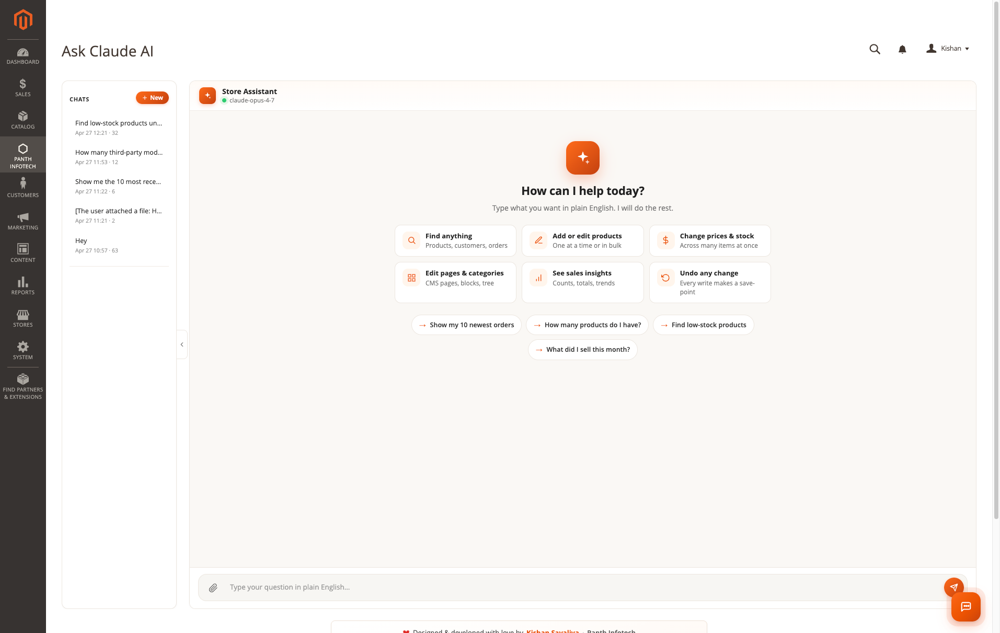
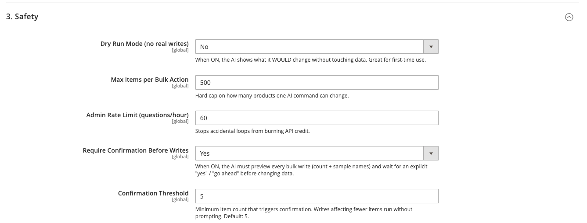
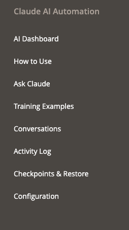
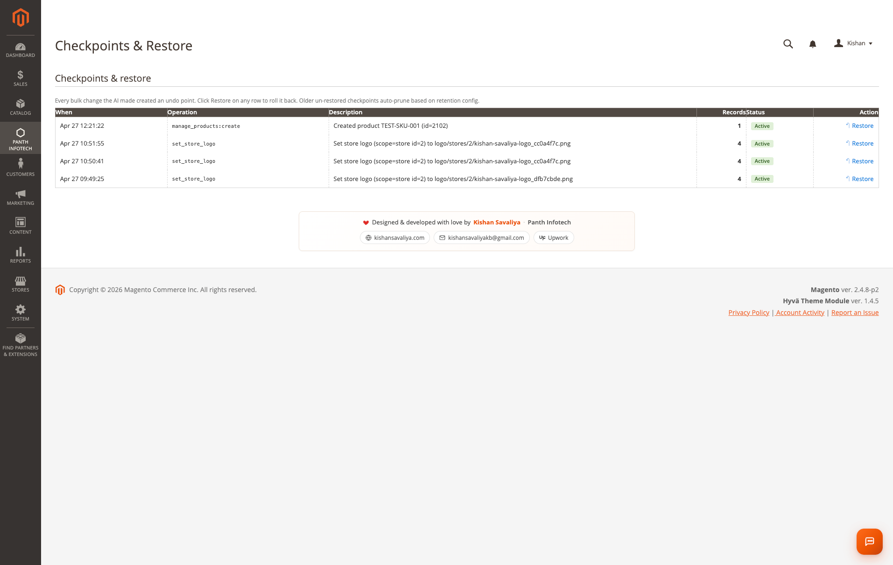
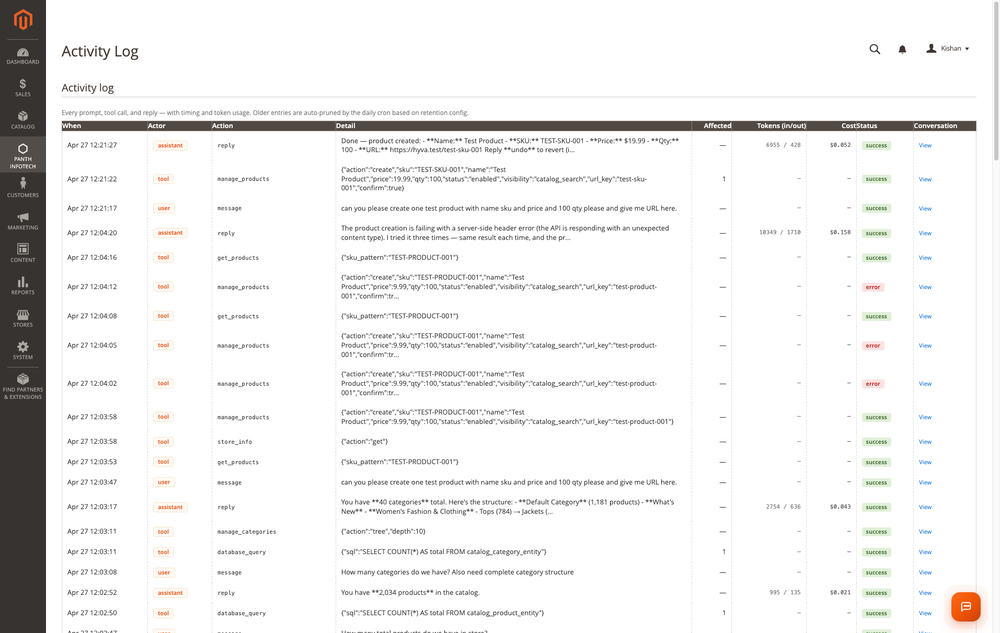

# Magento 2 Claude AI Automation

Panth_ClaudeAi adds a chat assistant to the Magento 2 admin that uses the Anthropic Claude API with tool use. Admin users type requests in plain English and the assistant answers them by calling a fixed set of Magento tools: searching products, customers and orders, running read-only database queries, and, when allowed, changing prices, stock, product status, categories, CMS content, a small set of store configuration values and the store logo. It needs an Anthropic API key. Each request sends the conversation, a system prompt, the enabled tool definitions and the results of the tools the assistant calls (which can include product, customer and order data) to `api.anthropic.com`.

Product page: [Magento 2 Claude AI Automation](https://kishansavaliya.com/magento-2-claude-ai.html)



## Features

- Admin chat page ("Ask Claude") plus a launcher on every admin page for users who have access to the chat (a small button in the page header by default, or a compact floating button; see General Settings > Launcher Position).
- AI Dashboard, "How to Use" page, Conversations history, Activity Log, Checkpoints and Training Examples pages in the admin menu.
- 19 tools, each of which can be switched off individually in configuration. A disabled tool is removed from the list sent to the API.
- Read tools: product search, customer search and lookup, order search and lookup, store insights (customer and order counts, orders by status, recent orders), low-stock products, store info, installed modules list, and a read-only database query tool (SELECT, WITH, SHOW, DESCRIBE, EXPLAIN; up to 100 rows).
- Write tools: create, update and clone products; bulk price changes (fixed price or percentage); bulk enable or disable; stock quantity changes; create and update categories and assign or remove products; create and update CMS pages and blocks; hold, unhold, cancel and comment on orders; write whitelisted configuration paths; set the store header logo from an uploaded image; flush caches and run indexers; restore checkpoints.
- No delete operations are exposed by any tool.
- Dry Run Mode (enabled by default) makes write tools report what they would change without saving.
- Per-call cap on the number of items a bulk tool may change (default 500).
- Checkpoints: before-state snapshots for product, price, status, stock, config, CMS page and logo writes, restorable from the Checkpoints page or by asking the assistant to undo.
- Training Examples: admin-curated example requests and expected behaviour that are added to the system prompt (up to 20 active examples). A set of starter examples is seeded on install.
- File attachments in chat (images, PDF, text-type files and some office/archive formats, up to 20 MB each).
- Per-message token usage and estimated cost stored with each conversation.
- CLI commands `panth_claudeai:status` and `panth_claudeai:test-api`.
- Nightly cron job that prunes old activity log rows, conversation messages, uploaded files and un-restored checkpoints.

## Compatibility

| Requirement | Versions |
|---|---|
| Magento Open Source | 2.4.4 to 2.4.8 |
| Adobe Commerce | 2.4.4 to 2.4.8 |
| PHP | 8.1, 8.2, 8.3, 8.4 (`~8.1.0\|\|~8.2.0\|\|~8.3.0\|\|~8.4.0`) |

Composer constraints: `magento/framework ^103.0`, `magento/module-backend ^102.0`, `magento/module-catalog ^104.0`, `magento/module-customer ^103.0`, `magento/module-sales ^103.0`, `magento/module-store ^101.0`, `magento/module-config ^101.0`, `magento/module-ui ^101.0`.

## Requirements

- `mage2kishan/module-core` (`Panth_Core`) ^1.0, installed automatically by Composer.
- An Anthropic API key. The configuration page links to the [Anthropic console API keys page](https://console.anthropic.com/settings/keys).
- The PHP cURL extension and outbound HTTPS access from the Magento server to `api.anthropic.com` (endpoint `/v1/messages`).
- Magento cron running, for the cleanup job.
- The module also declares a load order on Magento_CatalogInventory, Magento_Cms, Magento_Indexer, Magento_Cron and Magento_Widget in `etc/module.xml`.

## Installation

```bash
composer require mage2kishan/magento2-claude-ai
bin/magento module:enable Panth_Core Panth_ClaudeAi
bin/magento setup:upgrade
bin/magento setup:di:compile
bin/magento setup:static-content:deploy -f
bin/magento cache:flush
```

Run `setup:di:compile` and `setup:static-content:deploy -f` only when the store runs in production mode. The module ships admin CSS under `view/adminhtml/web`.

Check the module status:

```bash
bin/magento module:status Panth_ClaudeAi
```

After entering the API key, you can test connectivity with:

```bash
bin/magento panth_claudeai:test-api
```

This sends a short test request to the Anthropic API with the configured model and prints the reply and token counts.

## Configuration

Admin path: **Stores > Configuration > Panth Extensions > Claude AI - Magento Automation**

The "Panth Extensions" tab is provided by Panth_Core. All fields are available at the default (global) scope only. Access to this section is controlled by the ACL resource `Panth_ClaudeAi::config_section`.



### 1. API Credentials

| Field | Config path | Type | Default |
|---|---|---|---|
| Anthropic API Key | `panth_claudeai/api/api_key` | Obscured input, saved encrypted (`Magento\Config\Model\Config\Backend\Encrypted`) | empty |

### 2. General Settings

| Field | Config path | Type | Default |
|---|---|---|---|
| Enable Module (Master Switch) | `panth_claudeai/general/enabled` | Yes/No | Yes |
| Claude Model | `panth_claudeai/general/model` | Select: Claude Opus 4.7 (`claude-opus-4-7`), Claude Opus 4.6 (`claude-opus-4-6`), Claude Sonnet 4.6 (`claude-sonnet-4-6`), Claude Haiku 4.5 (`claude-haiku-4-5`) | `claude-opus-4-7` |
| Effort Level | `panth_claudeai/general/effort` | Select: `low`, `medium`, `high`, `xhigh` (labelled Opus 4.7 only), `max` (labelled Opus only) | `high` |
| Max Output Tokens per Reply | `panth_claudeai/general/max_tokens` | Number (minimum applied in code: 1024) | 8192 |
| Max Tool Calls per Question | `panth_claudeai/general/max_iterations` | Number | 8 |
| API Timeout (seconds) | `panth_claudeai/general/api_timeout` | Number (minimum applied in code: 10) | 120 |

### 3. Safety

| Field | Config path | Type | Default |
|---|---|---|---|
| Dry Run Mode (no real writes) | `panth_claudeai/safety/dry_run` | Yes/No | Yes |
| Max Items per Bulk Action | `panth_claudeai/safety/max_bulk_update` | Number | 500 |
| Admin Rate Limit (questions/hour) | `panth_claudeai/safety/rate_limit_per_hour` | Number | 60 |
| Require Confirmation Before Writes | `panth_claudeai/safety/require_confirmation` | Yes/No | Yes |
| Confirmation Threshold | `panth_claudeai/safety/confirmation_threshold` | Number | 5 |

The Admin Rate Limit is enforced by the `Chat\Send` and `Chat\Stream` controllers: each admin user can send at most this many chat questions per clock hour. The counter is kept in the Magento cache, so flushing the cache resets it.

When Enable Module (Master Switch) is No, the chat, stream, upload and conversation-load endpoints refuse requests and the chat page shows a warning.

### 4. Tool Capabilities (enable / disable per ability)

All tools default to Yes. Config paths are `panth_claudeai/tools/<tool name>`.

| Field | Tool name | Reads or writes |
|---|---|---|
| Search products | `get_products` | Read |
| Create / update / clone products | `manage_products` | Write |
| Update product prices | `update_product_price` | Write |
| Enable / disable products | `update_product_status` | Write |
| Adjust stock quantities | `update_inventory` | Write |
| Customer search & lookup | `customers` | Read |
| Order management (search, hold, cancel, comment) | `orders` | Read and write |
| Manage categories (create / update / tree / assign) | `manage_categories` | Read and write |
| Manage CMS pages | `manage_cms_pages` | Read and write |
| Manage CMS blocks | `manage_cms_blocks` | Read and write |
| Read-only database query (single SELECT) | `database_query` | Read |
| Customer & order insights (aggregates) | `store_insights` | Read |
| List installed modules | `get_modules` | Read |
| Find low-stock products | `get_low_stock_products` | Read |
| Read store info | `store_info` | Read |
| Write store config (whitelisted paths) | `update_config` | Read and write |
| Set storefront header logo | `set_store_logo` | Write |
| Flush caches & reindex | `cache_reindex` | Write (cache and index operations) |
| Undo / restore checkpoints | `restore_checkpoint` | Write |

### 6. Logging & Retention

The module has no group 5; the numbering is as defined in `system.xml`.

| Field | Config path | Type | Default |
|---|---|---|---|
| Enable Activity Log | `panth_claudeai/logging/enabled` | Yes/No | Yes |
| Activity Retention (days) | `panth_claudeai/logging/retention_days` | Number | 90 |
| Checkpoint Retention (days) | `panth_claudeai/logging/checkpoint_retention_days` | Number | 30 |
| Write to var/log/panth_claudeai.log | `panth_claudeai/logging/file_logger` | Yes/No | Yes |

When Enable Activity Log is No, nothing is written to `panth_claudeai_activity`. Conversation messages are still stored in `panth_claudeai_message` so chats can be reloaded.

When Write to var/log/panth_claudeai.log is Yes, the module's info, warning and error messages go to `var/log/panth_claudeai.log`. When it is No, the same messages go to `var/log/system.log` instead.

## Usage



The module adds a **Claude AI Automation** entry under the Panth_Core admin menu with these pages:

- **AI Dashboard** (`claudeai/dashboard/index`)
- **How to Use** (`claudeai/howto/index`)
- **Ask Claude** (`claudeai/chat/index`), the main chat page
- **Training Examples** (`claudeai/training/index`)
- **Conversations** (`claudeai/conversation/index`)
- **Activity Log** (`claudeai/activity/index`)
- **Checkpoints & Restore** (`claudeai/checkpoint/index`)
- **Configuration**, a link to the configuration section

A launcher is also rendered on every admin page when the module is enabled, an API key is set and the admin user has the `Panth_ClaudeAi::ai_chat` permission. General Settings > Launcher Position chooses where it sits: Page header (default, its own item in the header actions row next to the notifications bell; on narrow screens the page title wraps before it; never covers the page title, header controls, grids, forms or save bars) or Floating corner (a compact button in the bottom-left corner).

### Example requests

The tools support requests such as:

- "Show me products with low stock."
- "Reduce the price of all products whose name contains 'hoodie' by 10%."
- "Disable these SKUs: ..."
- "Create a product with SKU PT-HOODIE for 39.99 and add it to the Apparel category."
- "Put order 000000123 on hold and add a comment."
- "How many orders are in processing status?"
- "Set this uploaded image as the store logo."
- "Undo the last change."

### Writes, confirmations and dry run

- **Dry run.** When Dry Run Mode is Yes, write tools return a preview and do not save anything. Set it to No to allow real changes.
- **Confirmation (tool level).** When Require Confirmation Before Writes is Yes, the `manage_products`, `manage_categories`, `manage_cms_pages`, `manage_cms_blocks`, `update_config` and `set_store_logo` tools return a `needs_confirmation` status unless they are called again with `confirm=true`. Order cancellation always requires `confirm=true`, regardless of this setting.
- **Confirmation (prompt level).** For writes affecting more items than the Confirmation Threshold, the system prompt instructs the assistant to show the count and sample items and to wait for an explicit "yes" before calling the write tool.
- **Confirmation code (bulk tools).** When Require Confirmation Before Writes is Yes and Dry Run Mode is No, `update_product_price`, `update_product_status` and `update_inventory` refuse to change more products than the Confirmation Threshold until the admin confirms. The tool returns `needs_confirmation` with a six-character code, and the assistant asks the admin to reply with `CONFIRM <code>`. The change runs only when the admin's own next chat message contains that code and the tool is called again for the same products and the same change. Codes are stored in the Magento cache per admin user, expire after 30 minutes and can be used once. The assistant cannot confirm on the admin's behalf.
- **Bulk cap.** `update_product_price`, `update_product_status` and `update_inventory` refuse to change more items in one call than Max Items per Bulk Action.
- **Deletes.** No tool deletes entities. The system prompt also instructs the assistant to refuse delete requests and offer to disable instead.
- **Order comments.** `orders` with `add_comment` can email the comment to the customer when `notify_customer` is true (default false).
- **Store config.** `update_config` only reads and writes a fixed allow-list of paths (store information, transactional email sender names and addresses, header welcome text, logo alt/size, footer copyright and absolute footer, email logo and footer template, timezone, weight unit, first day of week). It can also delete a whitelisted value so it falls back to inheritance.

### Checkpoints and undo



Before a write, the product, price, status, stock, config, CMS page and logo tools store a before-state snapshot in `panth_claudeai_checkpoint` and return a checkpoint ID. A checkpoint can be restored from **Checkpoints & Restore** or by asking the assistant to undo (the `restore_checkpoint` tool). Only active checkpoints can be restored; a restored checkpoint cannot be restored a second time, and a checkpoint whose records all fail to restore stays active and the error is shown. Category, CMS block, order and cache/reindex actions do not create checkpoints.

### Conversations and activity log



- Every user message, assistant reply and tool result is stored in `panth_claudeai_message` with token counts, estimated cost in USD and the model used. The Conversations page shows these transcripts.
- The Activity Log (`panth_claudeai_activity`) records each user prompt (first 2000 characters), each tool call with its input and output, and each final reply with duration and token totals.
- Errors and chat events are logged to `var/log/panth_claudeai.log`, or to `var/log/system.log` when the file logger setting is No.

### Training examples

Training Examples are title, example request, expected outcome and category records. Up to 20 active examples are appended to the system prompt on every request.

### Cron cleanup

The cron job `panth_claudeai_cleanup` (group `default`, schedule `0 3 * * *`, daily at 03:00 server time) deletes activity log rows, stored conversation messages and uploaded files (the `panth_claudeai_attachment` rows and the files under `var/panth/claudeai/`) older than Activity Retention (days), and checkpoints with status `active` (not restored) older than Checkpoint Retention (days). Logos applied with `set_store_logo` are copies and are not removed.

### CLI

```bash
bin/magento panth_claudeai:status
bin/magento panth_claudeai:test-api
```

`panth_claudeai:status` shows configuration, enabled tools and recent activity counts. `panth_claudeai:test-api` sends a one-message request to verify the API key and connectivity.

## Data and privacy

Sent to the Anthropic API (`https://api.anthropic.com/v1/messages`, with the API key in the `x-api-key` header), on every model call in a chat turn. One admin question can trigger several calls, up to Max Tool Calls per Question:

- The system prompt, which includes the current safety settings and up to 20 active training examples.
- The definitions of all enabled tools.
- The conversation history held by the browser session, plus the new message.
- The results of every tool the assistant has called in the conversation. Depending on the tools used, these can contain product data, customer email addresses and names, order data (for example customer email and totals), store configuration values, installed module names and rows returned by `database_query`.
- Attached files: images and PDFs are sent base64-encoded; `txt`, `csv`, `json`, `xml`, `log` and `md` files are sent as text (first 200,000 characters). For other allowed file types only the file name, type, size and saved path are sent.
- The configured model, max tokens, effort level and adaptive thinking setting. The system prompt is marked for prompt caching.

The `database_query` tool accepts one SELECT statement only. It rejects comments, user and system variables, `INTO`/`OUTFILE`/`DUMPFILE`, `LOAD_FILE`, `SLEEP`, `BENCHMARK`, locking reads, multiple statements, the `mysql`, `performance_schema` and `sys` schemas, and `information_schema` tables other than `TABLES`, `COLUMNS`, `STATISTICS` and `KEY_COLUMN_USAGE`. It blocks the tables `admin_user`, `admin_user_session`, `admin_user_expiration`, `admin_passwords`, `authorization_*`, `oauth_*`, `integration`, `vault_payment_token*`, `jwt_auth_revoked`, `password_reset_request_event` and `login_as_customer*`; blocks column names containing password, secret, token, api key, card number or `additional_information`; and redacts such columns, values that look like Magento-encrypted strings and values that look like password hashes (bcrypt, argon2 and crypt formats, for example POS PIN hashes), in returned rows. `core_config_data` is read through a filter that hides rows under `payment/` and rows whose path contains password, key, secret or token. `customer_grid_flat` email, telephone and address columns are blocked or redacted. Results are capped at 100 rows and, on MySQL, each query has a 15 second execution limit. Other tables, including customer and order tables, can still be read and their rows are sent to the API. Disable the tool under Tool Capabilities if database rows must not be sent to the API.

The `panth_claudeai:test-api` command sends only a short fixed test message.

Stored locally:

| Data | Location | Retention |
|---|---|---|
| Messages, replies, tool results, token counts, cost | `panth_claudeai_message` | Pruned by cron after Activity Retention (days), default 90 |
| Activity log | `panth_claudeai_activity` | Pruned by cron after Activity Retention (days), default 90 |
| Checkpoint snapshots | `panth_claudeai_checkpoint` | Un-restored checkpoints pruned after Checkpoint Retention (days), default 30 |
| Uploaded file records | `panth_claudeai_attachment` | Pruned by cron after Activity Retention (days), default 90 |
| Uploaded files | `var/panth/claudeai/` (not publicly reachable; served to the uploading admin user through the `claudeai/chat/file` admin controller) | Pruned by cron after Activity Retention (days), default 90 |
| Training examples | `panth_claudeai_training` | Until deleted by an admin |
| Log file | `var/log/panth_claudeai.log` | Not rotated by the module |
| API key | `core_config_data`, encrypted | Until removed |

## Developer Notes

| Item | Value |
|---|---|
| Module name | `Panth_ClaudeAi` |
| Composer package | `mage2kishan/magento2-claude-ai` |
| PHP namespace | `Panth\ClaudeAi\` |
| Admin route | `claudeai` (admin router) |
| Depends on | `Panth_Core` |

Key classes:

- `Panth\ClaudeAi\Model\ClaudeClient` - HTTP client for the Messages API (API version header `2023-06-01`).
- `Panth\ClaudeAi\Model\Orchestrator` - builds the system prompt, runs the tool-use loop, records messages and activity.
- `Panth\ClaudeAi\Model\ToolRegistry` - tool catalog, configured as a virtual type in `etc/di.xml`. New tools implement `Panth\ClaudeAi\Model\Tool\ToolInterface` and are added to the `tools` argument.
- `Panth\ClaudeAi\Model\Tool\*` - the 19 tools listed under Configuration.
- `Panth\ClaudeAi\Model\CheckpointService` - checkpoint snapshots and restore.
- `Panth\ClaudeAi\Model\Config` - configuration reader (decrypts the API key).
- `Panth\ClaudeAi\Model\Pricing` - cost estimates per model.
- `Panth\ClaudeAi\Cron\Cleanup` - retention cleanup.
- Controllers `Chat\Send` (JSON) and `Chat\Stream` (server-sent events) handle chat requests; `Chat\Upload` handles attachments; `Chat\File` returns an uploaded file to the admin user who uploaded it; `Chat\Load` loads stored conversations.
- Chat history sent to the configured provider is rebuilt on the server from the stored messages of the conversation, limited to messages recorded for the current admin user. History supplied in the request body is ignored. A conversation id that belongs to another admin user, or has no recorded owner, starts a new conversation. Attachments are referenced by their upload id and their content is read on the server from the stored file owned by the current admin user.

ACL resources (under `Magento_Backend::admin` > `Panth_ClaudeAi::ai_root` "Claude AI Automation"):

| Resource | Title | Grants |
|---|---|---|
| `Panth_ClaudeAi::ai_dashboard` | AI Dashboard | Dashboard and How to Use pages |
| `Panth_ClaudeAi::ai_chat` | Ask Claude | Chat page, sending messages (enabled tools allowed by the role, see below), loading conversations, the floating launcher |
| `Panth_ClaudeAi::ai_upload` | File Upload | Attaching files in chat |
| `Panth_ClaudeAi::ai_training` | Training Examples | List, edit, save, delete training examples |
| `Panth_ClaudeAi::ai_conversations` | Conversations | Conversation list and detail |
| `Panth_ClaudeAi::ai_activity` | Activity Log | Activity log page |
| `Panth_ClaudeAi::ai_checkpoint` | Checkpoints | Checkpoint list and restore |
| `Panth_ClaudeAi::ai_config` | Configuration | Configuration menu link |
| `Panth_ClaudeAi::config_section` | Claude AI Configuration | The configuration section |

Tools are also checked against core Magento ACL resources of the admin user's role. A tool is offered to the assistant and can run only when the role has the matching resource:

| Tools | Required ACL resource |
|---|---|
| `get_products`, `manage_products`, `update_product_price`, `update_product_status`, `update_inventory`, `get_low_stock_products` | `Magento_Catalog::products` |
| `manage_categories` | `Magento_Catalog::categories` |
| `customers` | `Magento_Customer::manage` |
| `orders`, `store_insights` | `Magento_Sales::sales_order` |
| `manage_cms_pages` | `Magento_Cms::page` |
| `manage_cms_blocks` | `Magento_Cms::block` |
| `store_info`, `update_config`, `set_store_logo` | `Magento_Config::config` |
| `cache_reindex` | `Magento_Backend::cache` |
| `database_query` | `Magento_Backend::all` (roles with full access only) |
| `restore_checkpoint` | `Panth_ClaudeAi::ai_checkpoint` |
| `get_modules` | none beyond `Panth_ClaudeAi::ai_chat` |

Database tables: `panth_claudeai_activity`, `panth_claudeai_message`, `panth_claudeai_checkpoint`, `panth_claudeai_attachment`, `panth_claudeai_training`.

Data patches: `SeedTrainingExamples`, `BackfillEmptyConversationIds`, `MoveChatUploadsToPrivateStorage` (moves files from `pub/media/panth/claudeai/` to `var/panth/claudeai/`, removes the old `.htaccess` guard and the empty public folder; the stored relative paths such as `panth/claudeai/<file>` stay the same).

## Uninstallation

```bash
bin/magento module:disable Panth_ClaudeAi
composer remove mage2kishan/magento2-claude-ai
bin/magento setup:upgrade
bin/magento cache:flush
```

Composer removal and `module:disable` do not drop data. The following remain until removed manually:

- Tables `panth_claudeai_activity`, `panth_claudeai_message`, `panth_claudeai_checkpoint`, `panth_claudeai_attachment` and `panth_claudeai_training`.
- Configuration rows under `panth_claudeai/` in `core_config_data`, including the encrypted Anthropic API key (`panth_claudeai/api/api_key`).
- Uploaded files in `var/panth/claudeai/` and the log file `var/log/panth_claudeai.log`.

Changes the assistant made to products, categories, CMS content, orders and configuration are ordinary Magento data and are not reverted by uninstalling. Revoke the API key in the Anthropic console if it is no longer needed.

## Support

- Product page: [Magento 2 Claude AI Automation](https://kishansavaliya.com/magento-2-claude-ai.html)
- Contact: [kishansavaliya.com/contact](https://kishansavaliya.com/contact)
- Email: kishansavaliyakb@gmail.com
- Issues: [GitHub issues](https://github.com/mage2sk/magento2-claude-ai/issues)

## License

MIT, as declared in `composer.json`. The package is published on Packagist and can be installed with Composer; see the product page for the terms of use.

## Changelog

See [CHANGELOG.md](CHANGELOG.md).

## Links

- Website: [kishansavaliya.com](https://kishansavaliya.com)
- All extensions catalogue: [kishansavaliya.com/magento-extensions.html](https://kishansavaliya.com/magento-extensions.html)
- GitHub: [mage2sk/magento2-claude-ai](https://github.com/mage2sk/magento2-claude-ai)
- Packagist: [mage2kishan/magento2-claude-ai](https://packagist.org/packages/mage2kishan/magento2-claude-ai)
